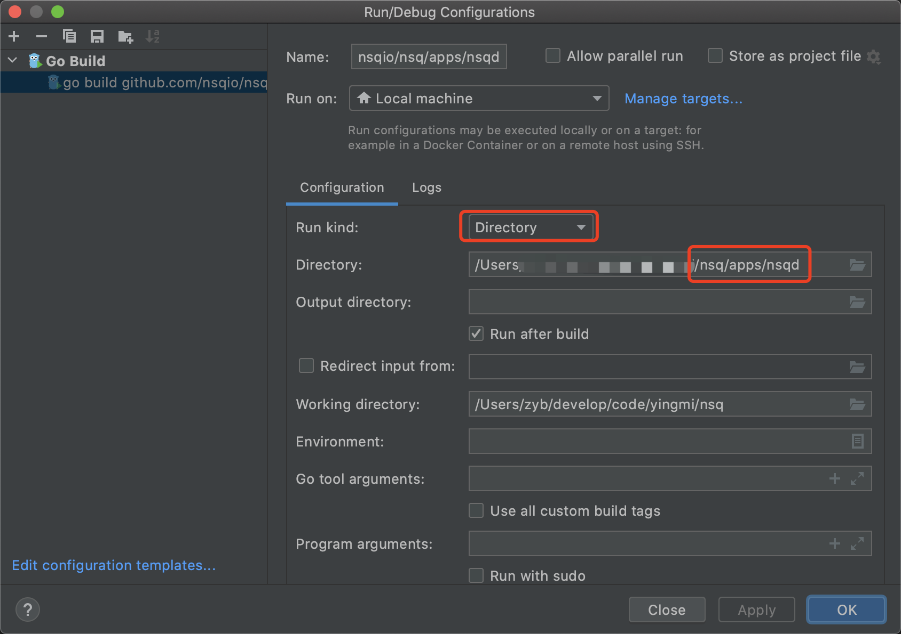

### fork 源码
访问 [GitHub NSQ源码](https://github.com/nsqio/nsq) ，为了以后方便代码管理，我们可以 fork nsq 源码到自己的 GitHub 帐号仓库下，比如我fork 到自己仓库的地址 https://github.com/geekymv/nsq

### 下载源码
下载代码到本地机器，访问自己的 GitHub 帐号刚刚 fork 点击 nsq 源码，点击 Code -> SSH -> 复制地址
在自己本地机器执行 `git clone` 下载源码
```shell
git clone git@github.com:geekymv/nsq.git
```

创建 git 分支
```shell
git checkout -b nsq-annotated
```
这样我们以后看代码都在这个分支上进行，可以任意修改代码、添加注释等
```shell
git push origin nsq-annotated
```

### 导入到开发工具
nsq 源码的依赖是通过 `go mod` 管理的，关于 `go mod` 的使用不熟悉的朋友可以自己搜索资料学习下，我这里就不过多赘述了。
将下载下来的源码导入到自己熟悉的开发工具，我这里导入到 GoLand。

### 下载依赖
```shell
go mod tidy
```

### 目录结构


### 启动 nsqd

apps/nsqd 目录下的`main.go` 是 `nsqd `入口，在 GoLand 开发工具中右键 直接执行` Run 'go build main.go'` 可能会报如下错误

```shell
# command-line-arguments
./main.go:36:13: undefined: nsqdFlagSet
./main.go:46:10: undefined: config

Compilation finished with exit code 2
```

` Run 'go build main.go'`这种方式只会运行 `main.go` 文件，`nsqd` 代码当然不会只有一个文件，我们这里可以以目录的方式运行，在 Goland 的右上方找到 `Edit Configurations` 并单击，编辑配置，把 `Run Kind` 改为 **Directory** ，把下面的 Directory 指定到 `main.go` 所在的 nsqd 目录，保存，再次运行点击右上角的 `Run` 或 `Debug` 即可运行。




### 运行 NSQD
NSQ 使用 `go-svc`库来启动 Service，执行 `svc.Run` 的时候调用 Service 实现的 `Init` 和 `Start` 方法，
同时监听两个信号量 `syscall.SIGINT` 和 `syscall.SIGTERM`，当信号量触发的时候调用 Service 实现的 `Stop` 方法实现优雅退出。

```go
type program struct {
	once sync.Once
	nsqd *nsqd.NSQD
}

func main() {
	prg := &program{}
	if err := svc.Run(prg, syscall.SIGINT, syscall.SIGTERM); err != nil {
		logFatal("%s", err)
	}
}
```

program 实现了 `go-svc` 中的 `Service`、`Context` 和 `Handler` 接口，主要是 `Service` 接口中的3个方法 `Init`、`Start` 和 `Stop`。


### svc.Run 生命周期
```go
package svc

import (
	"context"
	"os"
	"syscall"
)

// Run runs your Service.
//
// Run will block until one of the signals specified in sig is received or a provided context is done.
// If sig is empty syscall.SIGINT and syscall.SIGTERM are used by default.
func Run(service Service, sig ...os.Signal) error {
	env := environment{}
	// 调用 Init 初始化
	if err := service.Init(env); err != nil {
		return err
	}
    // 调用 Start 启动
	if err := service.Start(); err != nil {
		return err
	}
    // 设置默认的两个信号量
	if len(sig) == 0 {
		sig = []os.Signal{syscall.SIGINT, syscall.SIGTERM}
	}

	signalChan := make(chan os.Signal, 1)
	signalNotify(signalChan, sig...)

	var ctx context.Context
	// 判断 service 是否实现 Context 接口
	if s, ok := service.(Context); ok {
		ctx = s.Context()
	} else {
		ctx = context.Background()
	}

	for {
		select {
		// 会阻塞，等待系统信号量
		case s := <-signalChan:
			// 判断 service 是否实现 Handler 接口
			if h, ok := service.(Handler); ok {
				if err := h.Handle(s); err == ErrStop {
					goto stop
				}
			} else {
				// this maintains backwards compatibility for Services that do not implement Handle()
				goto stop
			}
		// 会阻塞，等待 Done	
		case <-ctx.Done():
			goto stop
		}
	}

stop:
	// 调用 Stop 方法
	return service.Stop()
}

type environment struct{}

func (environment) IsWindowsService() bool {
	return false
}

```

这里的实现有点模版方法的